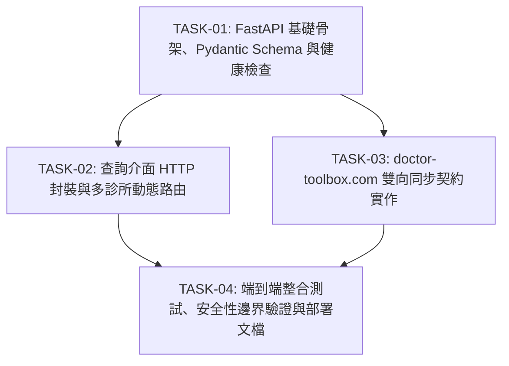

# Phase 05: doctor-toolbox.com 官方 API 整合與 HTTP 服務層架構規劃 (PLAN.md)

> 本文件為 **Phase 05** 的權威規劃與技術規格合約。依據專案規範與使用者指示，定義基於 FastAPI 的對外 HTTP 服務架構、自然語言查詢路由（`handle_query`）封裝，以及與 `doctor-toolbox.com`（或院所 HIS/EHR）之官方標準雙向資料同步契約（非舊系統之 MITM 攔截手法）。

---

## 1. 背景與核心目標

### 1.1 背景脈絡
在 Phase 01 至 04 中，系統已完成：
- 台灣健保 7,573 筆藥品與 2,669 筆診療服務項目、OTC 俗名在地化與 FTS5 trigram 全文檢索（Phase 01）。
- 本地 LLM 推理引擎（`llama-server` + Qwen3.8-27B）與中立立場雙層防禦（Phase 02）。
- 診所業務文件自動擷取、Q&A 轉換與 40 筆真實 FAQ 寫入正式庫（Phase 03）。
- 多診所架構、健保機構代碼（緻妍外科診所 `3503190424`）全面遷移與必填化，以及 FAQ 快取檢索與查詢路由整合（Phase 04）。

目前所有查詢與寫入邏輯皆為 Python 函式庫層級調用。為了讓前端、LINE 官方帳號、診間工作站及外部醫療雲端平台（`doctor-toolbox.com`）能夠安全、標準化地存取 clinicbrain，必須建立現代化的 Web API 服務層。

### 1.2 核心目標
1. **建立輕量高效的 FastAPI 服務層**：
   - 採用強型別 Pydantic 模型，自動生成符合 OpenAPI 3.1 標準之 Interactive API 文件（`/docs`, `/redoc`）。
   - 預設綁定本機環回介面（`127.0.0.1:8000`），落實隱私優先與最小暴露面。
2. **完整封裝自然語言查詢介面（`handle_query`）**：
   - 支援 HTTP JSON 請求，自動解析 `clinic_id`（支援 URL Path、Header `X-Clinic-ID` 或 Request Body）。
   - 嚴格落實法規安全邊界：全面自動套用 `mask_prices()` 價格遮蔽，杜絕任何金額數字外洩；`special` 路由強制檢查診所權限。
3. **建立與 doctor-toolbox.com 的官方雙向同步契約（Bidirectional Sync Contract）**：
   - **完全揚棄舊系統 `DrtoolboxLocalServer` 的 mitmproxy 流量攔截模式**（該模式需要安裝自簽 CA 憑證、攔截瀏覽器流量，脆弱且存在資安隱患）。
   - **全面改用標準 RESTful JSON API 契約**：
     - **Export (匯出/推播)**：增量匯出 PageIndex 臨床推理樹、FAQ 快取與自訂注意事項至雲端。
     - **Import (匯入/拉取)**：安全接收雲端修改之門診時間、自訂注意事項、醫師審定備註，並一律嚴格經由專案既有的「單一權威寫入路徑」（`upsert_trees`、`upsert_faqs`、`upsert_clinic_note`）進行增量 UPSERT，維護 `content_version`。
4. **審計與健康監控**：
   - 提供 `GET /health` 端點，即時回報 SQLite 連線、各資料表統計筆數與本地 LLM 狀態。
   - 新增 `sync_logs` 表，全程記錄雙向同步之時間、實體類型、筆數、狀態與錯誤訊息。

---

## 2. 強制性安全與合規準則 (Binding Constraints)

本 Phase 開發過程中，所有程式碼與設計必須嚴格遵守以下準則：

1. **價格遮蔽鐵則 (Zero Price Leakage)**：
   - 所有回傳病患之查詢結果（包括 `page_index_hits`、`faq_hits`、`clinic_custom_notes`、`drug_hits`）必須保證無具體價格數字或促銷組合。
   - API 輸出層必須進行二次驗證確保已套用 `mask_prices()`。
2. **純繁體中文原則 (Traditional Chinese Only)**：
   - 所有 API 回覆訊息、OpenAPI 說明、欄位描述、同步錯誤代碼一律使用繁體中文。
   - 匯入端點接收到簡體中文內容時，必須透過 `opencc` 轉換或拒絕，禁止簡體資料入庫。
3. **單一權威寫入路徑 (Single Authoritative Write Path)**：
   - 禁止在 API 路由中手寫 `INSERT INTO page_index_trees` 或 `INSERT INTO faq_cache`。
   - 臨床推理樹寫入一律呼叫 `src/pageindex/db_writer.py:upsert_trees()`。
   - FAQ 快取寫入一律呼叫 `src/pageindex/faq_writer.py:upsert_faqs()`。
   - 診所備註寫入一律呼叫 `src/clinic/custom_notes.py:upsert_clinic_note()`。
4. **測試環境絕對隔離 (Zero DB Pollution)**：
   - 所有測試（包括 FastAPI `TestClient` 測試）必須在 `tmp_path` 複本（`isolated_conn`）上運行，**嚴禁在測試過程對正式 `clinic.db` 執行任何寫入操作**。
   - 驗收時必須計算正式 `clinic.db` 之 SHA-256，確認位元完全不變。

---

## 3. 系統模組架構與檔案配置

```text
src/
├── api/
│   ├── __init__.py
│   ├── app.py                # FastAPI Application Factory, 中介軟體與例外處理
│   ├── config.py             # 服務設定（HOST, PORT, 預設 CLINIC_ID, API_KEY）
│   ├── dependencies.py       # DB 唯讀/寫入連線注入、API Key 權限檢驗
│   ├── models/               # Pydantic Schemas (強型別合約)
│   │   ├── __init__.py
│   │   ├── query.py          # 查詢請求與回應 Schema
│   │   ├── sync.py           # 雙向同步 Export/Import Payload Schema
│   │   └── common.py         # 健康檢查、錯誤模型與分頁 Schema
│   └── routes/
│       ├── __init__.py
│       ├── health.py         # GET /health
│       ├── query.py          # POST /api/v1/query, POST /api/v1/clinics/{clinic_id}/query
│       ├── sync.py           # POST /api/v1/sync/export, POST /api/v1/sync/import
│       └── clinic.py         # GET /api/v1/clinics/{clinic_id} (診所資訊、門診表)
tests/
├── test_api_health.py        # 健康檢查與組態測試
├── test_api_query.py         # 自然語言查詢端點與安全遮蔽測試
└── test_api_sync.py          # 雙向資料同步匯出與匯入測試
```

---

## 4. 具體任務拆解 (Tasks Breakdown)

Phase 05 規劃為 4 個獨立、可遞增驗證的子任務：



### TASK-01：FastAPI 基礎骨架、Pydantic Schema 與健康檢查
- **目的**：建立 Web API 服務的標準環境與型別基礎，提供即時狀態監控。
- **具體實作**：
  1. **相依管理**：於專案中引入 `fastapi`、`uvicorn`、`pydantic` 與 `httpx`（作為測試客戶端）。
  2. **`src/api/config.py`**：
     - `DEFAULT_CLINIC_ID: str = "3503190424"`
     - `API_KEY: Optional[str]`（若設定則啟用 X-API-Key 保護）
     - `HOST: str = "127.0.0.1"`, `PORT: int = 8000`
     - `DOCS_ENABLED: bool = True`
  3. **`src/api/dependencies.py`**：
     - `get_read_db()`: 產出唯讀連線（執行 `PRAGMA query_only = ON;`），杜絕查詢端點潛在寫入風險。
     - `get_write_db()`: 產出支援寫入之 WAL 模式連線，供 Import/Sync 端點專用。
     - `verify_admin_key()`: 檢查管理員 API 金鑰。
  4. **`src/api/models/`**：
     - 定義 `HealthResponse`（包含資料庫狀態、各表筆數、LLM 連線狀態）。
     - 定義基礎錯誤回應 `ErrorResponse`。
  5. **`src/api/routes/health.py`** 與 `src/api/app.py`：
     - 提供 `GET /health` 端點。
     - 測試：`tests/test_api_health.py` 驗證端點回應 200 與正確結構。

### TASK-02：查詢介面 HTTP 封裝與多診所動態路由
- **目的**：將 `src/query/router.py:handle_query()` 封裝為標準 HTTP 端點，支援完整的多診所隔離與價格保護。
- **具體實作**：
  1. **`src/api/models/query.py`**：
     - `QueryRequest`:
       - `query`: 必填字串（長度 1~500 字元）。
       - `clinic_id`: 可選字串（未傳時自動依 Header `X-Clinic-ID` 或組態 fallback；若路由為 `general` 則允許為 None）。
       - `limit`: 整數（預設 10，範圍 1~50）。
     - `SearchHitSchema`: 映射 `SearchHit`（`id`, `score`, `match_type`, `fields`）。
     - `QueryResponseSchema`: 映射 `QueryResponse`，包含 `route`, `reasoning`, `clinic_info`, `clinic_hours`, `page_index_hits`, `drug_hits`, `service_item_hits`, `clinic_custom_notes`, `faq_hits`。
  2. **`src/api/routes/query.py`**：
     - `POST /api/v1/query`: 全域查詢入口。
     - `POST /api/v1/clinics/{clinic_id}/query`: 依 URL 路徑鎖定診所 ID 之專用查詢入口。
     - `GET /api/v1/query`: 支援瀏覽器/除錯快速測試之 query string 模式。
  3. **安全防禦與錯誤分流**：
     - 攔截 `ValueError`（例如 `special` 路由缺少 `clinic_id`）：轉換為 HTTP 400 Bad Request 並附帶友善繁體中文說明。
     - 確保所有輸出欄位經 `mask_prices()` 處理。

### TASK-03：doctor-toolbox.com 雙向資料同步契約實作
- **目的**：建立與官方雲端平台的正規資料同步合約，支援雙向資料增量同步。
- **具體實作**：
  1. **資料表擴充 (`sync_logs`)**：
     - 記錄每次同步操作，包含同步方向、影響筆數與狀態。
  2. **`src/api/models/sync.py`**：
     - `SyncExportFilter`: 支援依 `since_version`、`since_timestamp`、`entities` (`trees`, `faqs`, `notes`, `hours`) 進行增量篩選。
     - `SyncExportPayload`: 包含時間戳記、診所代碼、版本號與匯出資料陣列。
     - `SyncImportPayload`: 包含欲同步至本地之診所資料、醫師備註與 FAQ 項目。
     - `SyncImportResult`: 回傳成功寫入、略過、失敗筆數與詳細訊息。
  3. **`src/api/routes/sync.py`**：
     - **匯出端點 (`POST /api/v1/sync/export`)**：
       - 依 `clinic_id` 讀取本地 `page_index_trees`、`faq_cache`、`clinic_hours`、`clinic_custom_notes`。
       - 支援 `since_version` 做增量拉取（僅回傳版本號大於指定值之列）。
       - 匯出之病患衛教與 FAQ 內容一律自動通過 `mask_prices()` 遮蔽。
     - **匯入端點 (`POST /api/v1/sync/import`)**：
       - 權限校驗：強制要求 `verify_admin_key()`。
       - 內容安全驗證：檢查簡體中文（自動轉繁或拒絕）、檢查不法保證用語。
       - 權威寫入呼叫：
         - 樹結構呼叫 `upsert_trees(conn, payload.trees, source_type='clinic_upload')`。
         - FAQ 結構呼叫 `upsert_faqs(conn, payload.faqs, source_type='clinic_upload')`。
         - 備註結構呼叫 `upsert_clinic_note(conn, clinic_id, sec, note)`。
       - 寫入 `sync_logs` 並回傳統計。

### TASK-04：端到端整合測試、安全性邊界驗證與部署文檔
- **目的**：落實測試覆蓋、驗證合規邊界，產出部署指引。
- **具體實作**：
  1. **自動化測試套件**：
     - `tests/test_api_health.py`: 測試伺服器健康狀態、資料庫統計正確性。
     - `tests/test_api_query.py`:
       - 測試 `POST /api/v1/query` 之 `special` 路由（音波拉提、瘦瘦筆、營業時間）。
       - 測試 `general` 路由（乙醯胺酚、健保點數）。
       - 測試缺少 `clinic_id` 時的錯誤處理（`special` 400，`general` 正常）。
       - 測試全回應無價格外洩（Regex 檢查）。
     - `tests/test_api_sync.py`:
       - 測試增量 Export 篩選。
       - 測試 Import 冪等寫入與 `content_version` 遞增。
       - 測試 Import 非法價格或簡體內容之拒絕/清洗。
  2. **測試資料庫隔離驗證**：
     - 測試執行前後驗證正式 `clinic.db` SHA-256 完全一致。
  3. **服務管理與 Systemd 部署範例**：
     - 產出 `scripts/run_api_server.py` 與 `clinicbrain-api.service` 設定範本。

---

## 5. API 契約詳細規格 (API Contract Specifications)

### 5.1 自然語言查詢端點

#### `POST /api/v1/query`
- **說明**：統一臨床與健保自然語言查詢入口。
- **Headers**：
  - `Content-Type: application/json`
  - `X-Clinic-ID: 3503190424` *(可選，若 Request Body 未帶則以此為準)*
- **Request Body**：
```json
{
  "query": "請問音波拉提術後要怎麼照顧？",
  "clinic_id": "3503190424",
  "limit": 5
}
```
- **Success Response (200 OK)**：
```json
{
  "query": "請問音波拉提術後要怎麼照顧？",
  "route": "special",
  "reasoning": "診所特化療程/衛教，導向特化 PageIndex 與 FAQ 檢索",
  "clinic_info": {
    "clinic_id": "3503190424",
    "name": "緻妍外科診所",
    "phone": "04-23800198",
    "address": "台中市南屯區惠文路320號",
    "website": "https://zhiyanclinic.com"
  },
  "clinic_hours": [
    {
      "day_of_week": "星期一",
      "morning_start": "09:00",
      "morning_end": "12:00",
      "afternoon_start": "13:30",
      "afternoon_end": "17:30",
      "evening_start": null,
      "evening_end": null,
      "is_open": true
    }
  ],
  "page_index_hits": [
    {
      "id": 1,
      "score": 0.85,
      "match_type": "fts",
      "fields": {
        "doc_id": "hifu-lifting",
        "title": "音波拉提臨床決策樹",
        "summary_text": "...",
        "post_op_short": "術後加強保濕與防曬，避免使用刺激性保養品...",
        "post_op_short_physician_notes": ""
      }
    }
  ],
  "faq_hits": [
    {
      "id": 10,
      "score": 0.92,
      "match_type": "fts",
      "fields": {
        "question": "音波拉提效果可以維持多久？",
        "answer": "一般約可維持1至2年，實際效果因個人體質及生活習慣而異。"
      }
    }
  ],
  "drug_hits": [],
  "service_item_hits": [],
  "clinic_custom_notes": {
    "post_op_short": "術後一週內避免高溫場所（三溫暖、溫泉）。"
  }
}
```
- **Error Response (400 Bad Request)**：
```json
{
  "detail": "本問題屬於診所特化業務/療程，必須提供有效的 clinic_id 健保機構代碼。"
}
```

---

### 5.2 雙向資料同步契約 (Sync Contract)

#### 1. 匯出端點 `POST /api/v1/sync/export`
- **說明**：由 `doctor-toolbox.com` 或院所管理後台呼叫，增量拉取本地已審定之臨床樹與 FAQ。
- **Request Body**：
```json
{
  "clinic_id": "3503190424",
  "since_version": 1,
  "entities": ["trees", "faqs", "notes", "hours"]
}
```
- **Success Response (200 OK)**：
```json
{
  "clinic_id": "3503190424",
  "exported_at": "2026-09-29T15:30:00Z",
  "counts": {
    "trees": 6,
    "faqs": 40,
    "notes": 3,
    "hours": 7
  },
  "data": {
    "trees": [
      {
        "doc_id": "hifu-lifting",
        "title": "音波拉提臨床決策樹",
        "content_version": 2,
        "pre_op": "...",
        "procedure": "...",
        "post_op_short": "...",
        "maintenance": "...",
        "physician_notes": {
          "pre_op": "",
          "procedure": "",
          "post_op_short": "",
          "maintenance": ""
        }
      }
    ],
    "faqs": [
      {
        "topic_key": "outpatient-surgery-procedures",
        "question": "請問粉瘤微創手術需要拆線嗎？",
        "answer": "本院微創粉瘤切除大多使用美容縫合線，視傷口狀況由醫師評估是否需於7至10天拆線。",
        "content_version": 1
      }
    ],
    "notes": {
      "pre_op": "術前請卸除全臉彩妝...",
      "post_op_short": "術後一週內避免高溫場所..."
    },
    "hours": [
      { "day_of_week": "星期一", "is_open": true, "morning_start": "09:00", "morning_end": "12:00" }
    ]
  }
}
```

#### 2. 匯入端點 `POST /api/v1/sync/import`
- **說明**：由 `doctor-toolbox.com` 官方管理平台推播醫師審定內容、新版 FAQ 或更新門診時間。
- **Headers**：
  - `X-API-Key: <ADMIN_SECRET_KEY>`
- **Request Body**：
```json
{
  "clinic_id": "3503190424",
  "data": {
    "notes": {
      "pre_op": "術前請務必停用阿斯匹靈等抗凝血藥物3天（須經開方醫師同意）。"
    },
    "faqs": [
      {
        "topic_key": "hifu-lifting",
        "question": "音波拉提會不會很痛？需要麻醉嗎？",
        "answer": "療程前會敷表面麻醉膏約30-40分鐘，施打時會有微酸熱感，多數顧客皆可適應。",
        "category": "special"
      }
    ],
    "trees_physician_notes": [
      {
        "doc_id": "hifu-lifting",
        "section": "post_op_short",
        "physician_note": "若施打探頭能量較高，術後返家前建議由護理人員冰敷15分鐘。"
      }
    ]
  }
}
```
- **Success Response (200 OK)**：
```json
{
  "success": true,
  "sync_id": 101,
  "summary": {
    "trees_updated": 1,
    "faqs_upserted": 1,
    "notes_updated": 1,
    "skipped_unchanged": 0
  },
  "message": "同步成功完成，資料已增量更新並寫入審計日誌。"
}
```

---

## 6. 資料庫變更與結構升級 (`sync_logs`)

為支援同步審計與故障追蹤，於 `src/db/clinic_schema.sql` 增補 `sync_logs` 資料表：

```sql
-- Sync audit logs table (Phase 05: Bidirectional API Sync)
CREATE TABLE IF NOT EXISTS sync_logs (
    id INTEGER PRIMARY KEY AUTOINCREMENT,
    clinic_id TEXT REFERENCES clinic_info(clinic_id),
    sync_type TEXT NOT NULL,         -- 'export' | 'import'
    direction TEXT NOT NULL,         -- 'push' | 'pull'
    status TEXT NOT NULL,            -- 'success' | 'failed' | 'partial'
    record_count INTEGER DEFAULT 0,
    payload_summary TEXT,            -- 簡要摘要（嚴禁記錄病患個資與具體價格）
    error_message TEXT,
    started_at TIMESTAMP DEFAULT CURRENT_TIMESTAMP,
    completed_at TIMESTAMP
);

CREATE INDEX IF NOT EXISTS idx_sync_logs_clinic_id ON sync_logs(clinic_id);
CREATE INDEX IF NOT EXISTS idx_sync_logs_started_at ON sync_logs(started_at);
```

---

## 7. 驗收標準與驗證清單 (Acceptance Criteria)

- [ ] **相依環境**：`fastapi`、`uvicorn`、`httpx` 安裝並納入環境，服務可正常啟動。
- [ ] **健康端點**：`GET /health` 能回報 SQLite 各表即時筆數與 LLM 狀態，狀態碼 200。
- [ ] **查詢端點**：
  - `POST /api/v1/query` 支援 `special` 與 `general` 雙向路由。
  - `special` 路由在缺少 `clinic_id` 時回傳 HTTP 400 錯誤。
  - 所有回傳欄位經由測試進行正規表達式價格掃描（`[0-9]+元`、`NT\$` 等），保證 100% 遮蔽。
- [ ] **雙向同步合約**：
  - `POST /api/v1/sync/export` 能根據 `clinic_id` 與版本號成功產生結構化匯出。
  - `POST /api/v1/sync/import` 能成功經由權威路徑寫入並觸發版本號遞增。
  - 含有簡體字或價格洩漏的惡意 Import 請求會被阻擋或安全清洗。
  - `sync_logs` 正確記錄每次同步歷史。
- [ ] **測試與資料庫零污染**：
  - 新增之 `test_api_health.py`、`test_api_query.py`、`test_api_sync.py` 全部通過。
  - 原有 128 個測試（含 Phase 01~04 回歸測試）保持 100% 通過（總測試數預期達 145+）。
  - 正式 `clinic.db` SHA-256 全程保持不變。
