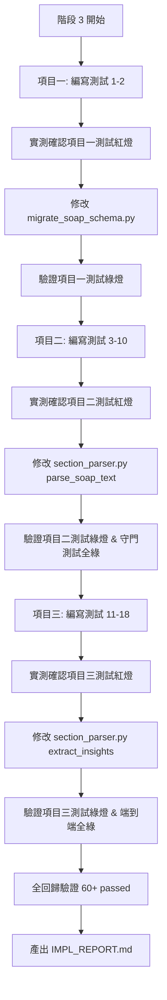

# Phase 14 SOAP 剩餘項目改善執行計畫 (PLAN.md - 實施核定版)

> **版本狀態**：實施核定版（依 2026-10-07 使用者四項決策結論定稿）。  
> **決策摘要**：全部採方案 A（疑似/R/O 排除、Assessment 為空 conditions 留空、英文縮寫不映射、取消單字母空白分隔並強制標點）。原暫緩測試全部轉為正式紅燈 TDD 測試，納入實作範圍。  
> **安全與合規守則**：全程嚴格遵循 `AGENTS.md`（繁體中文、FTS5 trigram 鐵則、單一權威寫入路徑、正式庫寫入絕對防禦）。

---

## 一、使用者已決策事項（2026-10-07 決策核定）

以下四項醫療語意與解析行為決策已於 2026-10-07 經使用者確認，**全數採行方案 A**，並做為本次實作之權威規格依據：

| 決策項目 | 決策結論（方案 A） | 具體行為與規範 | 影響與實施要求 |
|---|---|---|---|
| **決策一：臨床疑似／R/O 語意** | **保守排除** | 凡帶有「疑似」、「鑑別診斷」、「R/O」、「rule out」之病症一律不納入正面 `conditions` 與標籤。 | `r/o`、`rule out`、`疑似`、`鑑別診斷` 正式納入前置否定與排除片語表。未確診疾病零污染。 |
| **決策二：Assessment 為空降級** | **保守留空** | 若 `assessment` 為空，`conditions` 一律保持為空清單 `[]`，只從 S/O 擷取 `symptoms`。 | 杜絕主訴中病患擔憂（如「自述同事得流感」）被誤判為診斷。純語音無標記逐字稿退化時 conditions 留空。 |
| **決策三：英文臨床縮寫對照** | **不進行映射** | 不擅自建立 `URI → 感冒`、`AGE → 急性腸胃炎` 臨床映射，特徵擷取僅依詞表中之繁體中文標準詞比對。 | 保持醫療語意零失真，不引入未經醫師簽核之縮寫定義誤差。 |
| **決策四：取消單字母空白分隔** | **強制標點** | 英文標記（S/O/A/P 與全稱）一律強制要求冒號、句點、成對括號或連字號（` - `），不再支援單純空白分隔（`S cough`）。 | 徹底根除 `A 35-year-old`、`Plan to evaluate` 等常規英文單字衝突。推播要求標準標點。 |

---

## 二、三項核心改善規格

### 項目一：`scripts/migrate_soap_schema.py --dry-run` 執行失敗修復
1. **現況問題**：
   - 預設目標為正式庫 `PROD_DB_PATH` 時，第 106 行防禦檢核在第 127 行 `--dry-run` 前提早阻斷，回傳碼 `2`。
2. **修法規格**：
   - 檔案：`scripts/migrate_soap_schema.py`
   - 調整安全防禦條件：
     ```python
     # 僅在非 dry-run 且目標為正式庫時，強制要求備份確認旗標
     if not args.dry_run and is_prod and not args.confirm_prod_backup:
         print(..., file=sys.stderr)
         return 2
     ```
   - Dry-Run 分支維持純記憶體 DDL 解析與標準輸出印出，嚴禁呼叫 `sqlite3.connect`。
   - 保留第 96 行目標檔案存在性檢查（檔案不存在回傳 2，合理防禦，不自動建檔）。
3. **測試與安全隔離**：
   - 所有測試強制使用 `monkeypatch.setattr(scripts.migrate_soap_schema, "PROD_DB_PATH", tmp_path / "clinic.db")`。
   - 加入 mock `sqlite3.connect` 斷言 dry-run 期間零連線。

---

### 項目二：`section_parser.parse_soap_text` 段落切分準確度改善
1. **現況問題**：
   - 逐行 `^` 比對無法切分行內標記；英文單字 "A " 與 "Plan " 衝突；全形空白前導冒號殘留。
2. **修法規格**：
   - 檔案：`src/soap/section_parser.py`
   - **前置正規化**：將 `\r\n`、`\t`、全形空白（`\u3000`）標準化。
   - **合格候選標記前導邊界（B1）**：
     必須位於：(1) 行首/全文起點、(2) 空白字符後、(3) 主要標點（`。；！？，、`）後、或 (4) 成對括號起點（`【`、`[`、`(`、`（`）。
   - **後置分隔符嚴格化（B2 & 決策四）**：
     - 單字母（S, O, A, P）：必須接 `:`、`：`、`.` 或括號封裝，**嚴格禁止純空白分隔**（徹底排除 `A 35-year-old`）。未帶標點之 `S cough` 不再視為標記，退化至 subjective。
     - 英文全稱（Subjective, Objective, Assessment, Plan）：必須接 `:`、`：`、括號封裝、或連字號 ` - `，**禁止純空白分隔**（徹底排除 `Plan to evaluate`）。
     - 中文標記（主訴、理學檢查、診斷、處置等）：支援冒號、括號標籤封裝。單獨「檢查」詞彙必須具備冒號或括號，防止「未做檢查」敘述句誤切。
   - **區間切分與保護（W6）**：
     - 連續重複標記（`主訴：頭痛 主訴：發燒`）自動累加至同一段落。
     - Plan 段內之子標籤（`衛教事項：`）保留於 Plan 段落中。
     - 若全文未檢測出合格標記，全文安全 fallback 歸入 `subjective`。

---

### 項目三：`extract_general_medical_insights` 特徵擷取與否定防禦
1. **現況問題**：
   - 缺乏否定語境分析（「排除流感」被當成確診流感；「無發燒」被當成現存症狀）；頓號列舉否定漏判；轉折詞未分流；子字串冗餘重複。
2. **修法規格**：
   - 檔案：`src/soap/section_parser.py`
   - **精確否定片語白名單（含決策一）**：
     - 前置否定詞：`無`、`未有`、`未出現`、`沒有`、`否認`、`排除`、`不見`、`非`、`不是`、`r/o`、`rule out`、`疑似`、`鑑別診斷`。
     - 排除黑名單（嚴防誤殺，B3）：明確排除 `非常`、`無法`、`未見好轉`、`非但`、`無特殊`。
     - 後置否定詞：`陰性`、`未檢出`（如 `流感快篩陰性`）。
   - **列舉延續與轉折中斷（B3）**：
     - 子句內以頓號（`、`）或連接詞連接之序列（`無發燒、咳嗽、腹瀉`），整組序列否定。
     - 遇到轉折詞（`但`、`然而`、`不過`、`伴隨`、`出現`、`伴有`、`合併`）或句末標點，立即終止否定狀態（`無發燒，但有咳嗽` → 排除發燒，保留咳嗽）。
   - **Assessment 空白 conditions 留空（決策二）**：
     - `conditions` 僅從 `assessment` 擷取；若 `assessment` 為空，`conditions` 保持 `[]`，絕不讀取 `subjective`。
   - **最長匹配去重**：關鍵字長度降序掃描，長詞（`急性咽喉炎`）覆蓋之子詞（`咽喉炎`）不重複計入。
   - **英文單字邊界（W4）**：比對英文詞彙一律使用 `\b` 單字邊界與大寫精確比對。

---

## 三、測試分類清單（守門測試 vs 紅燈 TDD 測試）

### 類別 A：現況已綠的守門測試（Regression Guards，防回歸）
以下測試在現況環境中**已全數通過**，實施過程中必須持續維持綠燈：

1. **`test_guard_chinese_negation_in_narrative_stays_subjective`**
   - 語料：`"病患主訴未做過任何身體檢查與評估，僅覺頭痛"`
   - 現況實測：全句完整保留於 subjective，未被中途截斷。
2. **`test_guard_pure_audio_transcript_fallback`**
   - 語料：`"病患昨晚開始頭暈眼花，胃部脹痛想吐，沒有腹瀉。"`
   - 現況實測：無標記逐字稿乾淨退化歸入 subjective。
3. **`test_guard_non_negated_adverbs_preserved`**
   - 語料：`subjective="非常頭痛，未見好轉的咳嗽"`
   - 現況實測：`symptoms=['頭痛', '咳嗽']`，副詞未誤殺症狀。
4. **既有 42 項 SOAP 核心測試**：
   - 現況實測：`pytest tests/test_soap*` → `42 passed, 1 skipped`。

---

### 類別 B：正式紅燈 TDD 測試清單（Red TDD Tests，納入實作驗證）
以下測試在現行程式碼**必定失敗（紅燈）**，需透過 TDD 依序轉綠：

#### 【項目一測試】（檔案：`tests/test_soap_hardening.py`）
1. `test_red_migrate_soap_schema_dry_run_exits_zero`
   - 現況實測：退出碼 `2`（拒絕操作）。
   - 修復預期：退出碼 `0`，輸出 DDL 內容。
2. `test_red_migrate_soap_schema_dry_run_no_connect`
   - 現況實測：被安全檢查提前拋出退出碼 2。
   - 修復預期：mock `sqlite3.connect` 驗證 dry-run 期間 connect 呼叫次數為 `0`。

#### 【項目二測試】（檔案：`tests/test_soap_deid_parser.py`）
3. `test_red_parse_soap_inline_chinese_markers`
   - 語料：`"主訴：喉嚨痛 理學檢查：喉嚨紅 診斷：咽喉炎 處置：多喝水"`
   - 現況實測：全文字串全卡在 subjective，後續三段為空。
   - 修復預期：正確切分四個區塊。
4. `test_red_parse_soap_bracketed_headers`
   - 語料：`"【主訴】發燒三天 【客觀】體溫38度 【診斷】流感 【處置】給予克流感"`
   - 現況實測：全文字串落在 subjective。
   - 修復預期：正確切分四個區塊。
5. `test_red_parse_soap_english_article_a_not_confused`
   - 語料：`"A 35-year-old male presents with headache"`
   - 現況實測：`assessment='35-year-old male presents with headache'`（嚴重誤切）。
   - 修復預期：`subjective='A 35-year-old male presents with headache'`, `assessment=''`。
6. `test_red_parse_soap_plan_word_not_confused`
   - 語料：`"Plan to evaluate next Monday"`
   - 現況實測：`plan='to evaluate next Monday'`（嚴重誤切）。
   - 修復預期：`subjective='Plan to evaluate next Monday'`, `plan=''`。
7. `test_red_parse_soap_single_letter_space_delimiter_rejected`（決策四實施）
   - 語料：`"S cough\nO clear\nA flu\nP rest"`
   - 現況實測：因允許空白分隔而切分。
   - 修復預期：因單字母嚴格禁止純空白分隔，全文安全退化至 subjective。
8. `test_red_parse_soap_fullwidth_space_colon_clean`
   - 語料：`"主訴　：喉嚨痛"`
   - 現況實測：`subjective='：喉嚨痛'`（冒號殘留）。
   - 修復預期：`subjective='喉嚨痛'`。
9. `test_red_parse_soap_duplicate_marker_merge`（W6）
   - 語料：`"主訴：頭痛 主訴：發燒三天"`
   - 現況實測：行內第二個主訴被當作內容。
   - 修復預期：主訴合併為包含頭痛與發燒。
10. `test_red_parse_soap_sublabel_in_plan_preserved`（W6）
    - 語料：`"處置：開立退燒藥。衛教事項：多喝水休息"`
    - 修復預期：全文字串完整保留於 Plan，不碎裂。

#### 【項目三測試】（檔案：`tests/test_soap_deid_parser.py` 及 `tests/test_soap_api.py`）
11. `test_red_insights_negation_conditions`
    - 語料：`assessment="排除流感，確診普通感冒"`
    - 現況實測：`conditions=['感冒', '流感']`。
    - 修復預期：`conditions=['感冒']`（排除流感）。
12. `test_red_insights_negation_symptoms`
    - 語料：`subjective="無發燒、無咳嗽，否認腹瀉"`
    - 現況實測：`symptoms=['發燒', '咳嗽', '腹瀉']`。
    - 修復預期：`symptoms=[]`。
13. `test_red_insights_enumeration_negation`
    - 語料：`subjective="無發燒、咳嗽"`
    - 現況實測：`symptoms=['發燒', '咳嗽']`。
    - 修復預期：`symptoms=[]`（頓號延續否定）。
14. `test_red_insights_conjunction_scope_breaker`
    - 語料：`subjective="無發燒，但有咳嗽"`
    - 現況實測：`symptoms=['發燒', '咳嗽']`。
    - 修復預期：`symptoms=['咳嗽']`（轉折詞後保留咳嗽）。
15. `test_red_insights_rule_out_and_suspected_excluded`（決策一實施）
    - 語料：`assessment="R/O 流感，疑似急性支氣管炎，確診普通感冒"`
    - 現況實測：`conditions` 同時收錄感冒、流感、支氣管炎。
    - 修復預期：`conditions=['感冒']`（排除 R/O 流感與疑似支氣管炎）。
16. `test_red_insights_empty_assessment_conditions_empty`（決策二實施）
    - 語料：`subjective="自述同事罹患流感，非常擔心", assessment=""`
    - 現況實測：`conditions=['流感']`（污染確診疾病）。
    - 修復預期：`conditions=[]`（Assessment 為空則 conditions 保持空清單）。
17. `test_red_insights_subsumption_dedup`
    - 語料：`assessment="急性咽喉炎"`
    - 現況實測：`conditions=['急性咽喉炎', '咽喉炎']`。
    - 修復預期：`conditions=['急性咽喉炎']`（最長匹配去重）。
18. `test_red_api_ingest_tags_negation_clean`（W3 端到端）
    - 動作：以 TestClient POST `/api/v1/soap/records`，內文帶有「無發燒、排除流感」。
    - 修復預期：資料庫內儲存之 `tags` 不包含發燒與流感。

---

## 四、實施順序與驗收指令（TDD 標準流程）

實作者必須嚴格按照**「項目一 → 項目二 → 項目三」**循序實作，每項恪守**「先寫測試確認紅燈 → 修改程式碼 → 確認轉綠燈」**：



### 步驟 1：項目一（遷移腳本 Dry-Run）
1. **先寫測試**：於 `tests/test_soap_hardening.py` 增加測試 1、2。
2. **確認紅燈**：
   ```bash
   python3 -m pytest tests/test_soap_hardening.py -k "migrate_soap_schema"
   ```
3. **修訂程式碼**：調整 `scripts/migrate_soap_schema.py` 第 106 行防禦條件。
4. **確認綠燈與驗收**：
   ```bash
   python3 scripts/migrate_soap_schema.py --dry-run && sha256sum clinic.db
   python3 -m pytest tests/test_soap_hardening.py -k "migrate_soap_schema"
   ```
   *預期*：dry-run 印出 DDL 且結束碼 0；clinic.db 雜湊維持 `ad24426c`；測試全綠。

### 步驟 2：項目二（SOAP 段落切分與標記嚴格化）
1. **先寫測試**：於 `tests/test_soap_deid_parser.py` 增加測試 3 至 10。
2. **確認紅燈**：
   ```bash
   python3 -m pytest tests/test_soap_deid_parser.py -k "test_red_parse_soap"
   ```
3. **修訂程式碼**：改寫 `src/soap/section_parser.py:parse_soap_text`。
4. **確認綠燈與驗收**：
   ```bash
   python3 -m pytest tests/test_soap_deid_parser.py -k "parse_soap"
   ```
   *預期*：所有新切分測試與守門測試全部 PASS。

### 步驟 3：項目三（否定語境防禦與特徵擷取）
1. **先寫測試**：於 `tests/test_soap_deid_parser.py` 與 `tests/test_soap_api.py` 增加測試 11 至 18。
2. **確認紅燈**：
   ```bash
   python3 -m pytest tests/test_soap_deid_parser.py tests/test_soap_api.py -k "test_red"
   ```
3. **修訂程式碼**：改寫 `src/soap/section_parser.py:extract_general_medical_insights`。
4. **確認綠燈與驗收**：
   ```bash
   python3 -m pytest tests/test_soap_deid_parser.py -k "insights"
   python3 -m pytest tests/test_soap_api.py -k "tags"
   ```
   *預期*：所有特徵與 API 測試全部 PASS。

### 步驟 4：全套回歸驗收
```bash
python3 -m pytest tests/test_soap*.py
sha256sum clinic.db
```
*預期輸出*：
- 所有 SOAP 測試全部通過（42 既有項 + 18 新增項 = 60+ passed，0 failed）。
- `clinic.db` SHA-256 前綴維持 `ad24426c`。

---

## 五、階段 3 實作者須知（強制執行規範）

實作階段（Phase 14 實作執行者）必須嚴格遵守以下操作邊界：

1. **唯一允許修改的檔案清單**：
   - 原始碼：`scripts/migrate_soap_schema.py`、`src/soap/section_parser.py`
   - 測試碼：`tests/test_soap_hardening.py`、`tests/test_soap_deid_parser.py`、`tests/test_soap_api.py`
   - 報告書：`.planning/pipeline/phase14-remaining/IMPL_REPORT.md`（實作完成後建立）
   - **嚴禁修改任何其他檔案**（包含 `src/api/routes/soap.py`、`src/batch/`、`src/query/`、`clinic_schema.sql`、`PLAN.md`、`PLAN.v1.md`、`PLAN.v2.md`）。
2. **Git 操作禁令**：
   - **嚴禁執行 `git add`、`git commit`、`git push`**。所有變更維持於 working directory，等待使用者驗收審核。
3. **正式庫寫入禁令**：
   - **嚴禁對 `clinic.db` 發起任何寫入操作**。測試一律使用 `tmp_path` 與 `monkeypatch`。
   - 實作完成後必須以 `sha256sum clinic.db` 確認雜湊前綴維持 `ad24426c`。
4. **完工回報要求**：
   - 實作者完成所有實作與測試轉綠後，必須建立 `.planning/pipeline/phase14-remaining/IMPL_REPORT.md`，內容詳列：
     - 各檔案實質變更清單（Modified Files & Summary）。
     - TDD 紅燈（先失敗）與綠燈（轉成功）的真實終端機輸出截圖/紀錄。
     - 最終 `pytest tests/test_soap*.py` 全綠輸出與 `sha256sum clinic.db` 雜湊比對。
